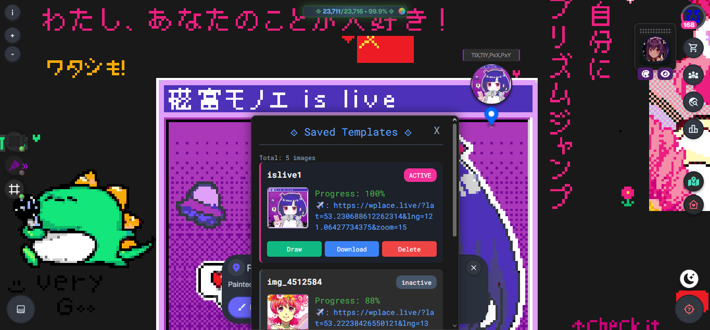

WPlace Gliz (WGliz)
Version: 1.73.0 | Platform: PC & Mobile | Extension: Edge

Advanced template tool for WPLACE with color converter, progress tracking, and visual guides for efficient pixel painting.

 
<h2>Installation</h2>
<h3>Option 1: User Script (Recommended)</h3>
⟐ Copy and paste <a href="https://raw.githubusercontent.com/yui-ho/WPlace-GGliz/refs/heads/main/dist/gliz.userscript.js" target="_blank" rel="noopener noreferrer" ><strong>the userscript from this fork</strong></a> into the script manager such as Violentmonkey, Tampermonkey, or Greasemonkey.

 
<h3>Option 2: Edge Extension (Microsoft Edge Only)</h3>

* Available in Microsoft Edge Add-ons Store
* Search for: "WPlace Gliz" in the extensions store - <a href="https://microsoftedge.microsoft.com/addons/search/Wplace%20Gliz" target="_blank" ><strong>External link</strong></a>
* On mobile devices you can use Edge Canary with developer options to install the extension by ID: "jfbmeppgpommhfdnnemhklefoommabof"

<h2>Key Features</h2>
<h3>Template System</h3>
<ul>
<li><b>Create & Save Functionality:</b> Generate temporary templates or save them persistently for future use.</li>
<li><b>Template Sharing:</b> Download and upload the image with the coordinates in the filename.</li>
<li><b>Visual Template Management:</b> Dedicated interface for viewing and managing all saved templates</li>
<li><b>Progress Tracking:</b> Real-time monitoring of painting progress with detailed statistics.</li>
<li><b>Quick Actions:</b> Instant activation, download, or deletion of templates.</li>
</ul>

<h3>Color Management</h3>
<ul>
<li><b>WPLACE Palette Integration:</b> Automatic conversion to official WPLACE color palette.</li>
<li><b>Premium Color Support:</b> Optional inclusion/exclusion of premium colors</li>
<li><b>Advanced Dithering:</b> Configurable dithering for smooth gradient transitions.</li>
<li><b>Preview Window:</b> Visual preview of color conversions after application.</li>
</ul>

<h3>Painting Tools</h3>
<ul>
<li><b>Configurable Backgrounds:</b> Customizable color and transparency for template backgrounds.</li>
<li><b>Painting Overlay:</b> Background overlay displaying only pending pixels during painting.</li>
<li><b>Error Highlighting:</b> Customizable highlighting for incorrectly painted pixels.</li>
<li><b>Contextual Palette:</b> Displays only colors used in active template with progress percentages.</li>
<li><b>Progress Bar:</b> Visual progress tracking in header section.</li>
<li><b>Real-time Updates:</b> Changes reflect on next tile refresh (approximately 2-5 seconds)</li>
<li><b>Eyedropper Mode:</b> Complete hiding of the color palette. When using the eyedropper: temporary conversion of dots to full pixels for precise color selection.</li>
</ul>

<h2>Usage Guide</h2>
<h3>Creating Your First Template</h3>

1. Select Coordinates: Click anywhere on the map to set coordinates
2. Upload Image: Use the image selection button to choose your template
3. Choose Method:
     - Create: Temporary template for immediate use        
     - Save: Persistent template with automatic saving
4. Start Painting: Template automatically overlays on the map

<h2>Controls and Interface</h2>
<h3>Left Side Controls</h3>

* **Background:** Activate/configure template background color and transparency.
* **Highlighter:** Configure error highlighting and pending pixel visualization.
* **Template:** Activate/deactivate current template.

<h3>Right Side Controls</h3>

* **Templates:** Complete template management interface.
* **Teleport:** Navigate to active template location.
* **Night Mode:** Toggle dark map background.

<h3>Contextual Controls (Map Click)</h3>

* **Coordinates:** Editable input with "TlX,TlY,PxX,PxY" format.
* **Navigate to Location:** Jump to specific coordinates (Go button)
* **Select Image:** Load image for template creation.
* **Create:** Generate temporary template.
* **Save:** Create persistent template.
* **Templates:** Open template manager.

<h3>Options Panel Configuration</h3>

* Enable/disable features according to your preferences

| Option | Description | Recommendation |
|-|-|-|
| Premium Colors | Include premium colors in conversions | Recommended for better quality |
| Dithering | Apply dithering in color conversions | Recommended for gradients |
| Background Overlay | Overlay background during painting | Recommended for better contrast |
| Unpainted Highlighter | Highlight unpainted pixels | Based on preference |
| Disable Color Picker | Disable color picker during painting |  |
| Hide WPLACE Palette | Eyedropper mode |  |

